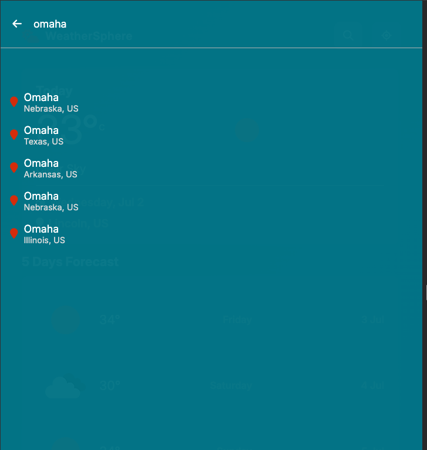
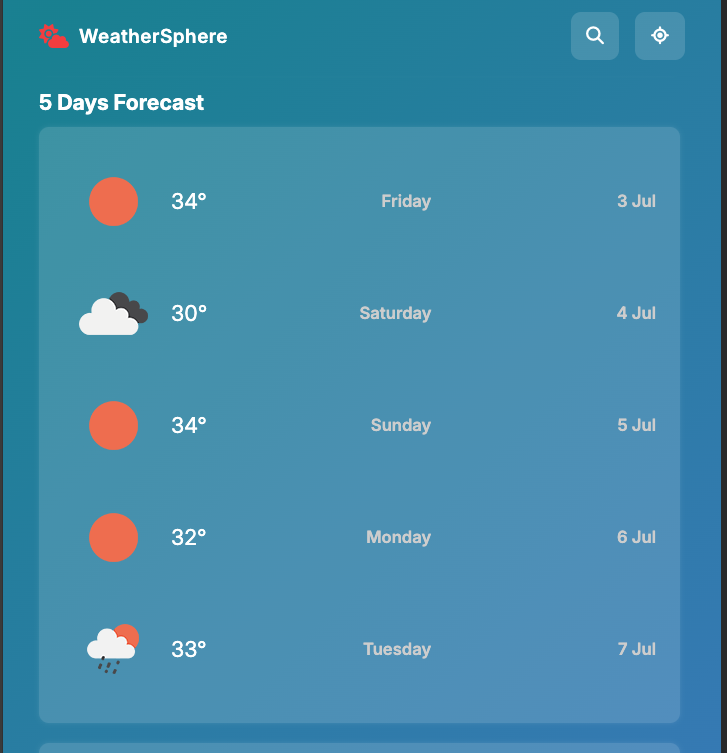
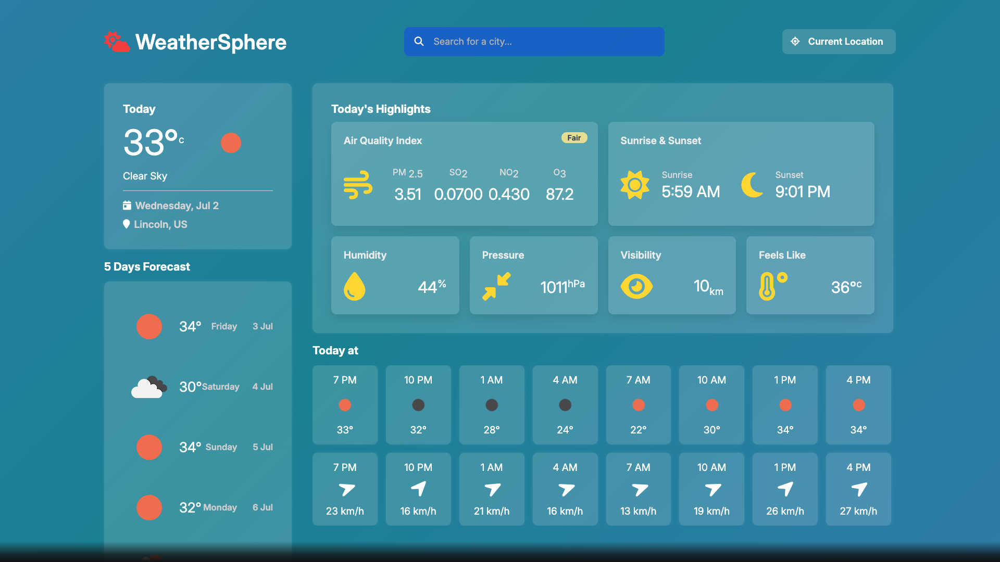

# Weather App

## 🖼️ Screenshots

| Search & Location | Forecast Cards | AQI & Highlights |
|-------------------|----------------|------------------|
|  |  |  |

## Overview
A sleek, responsive weather dashboard that provides current conditions, air quality index, hourly forecasts, and a 5-day forecast using data from the OpenWeatherMap API. Users can search for cities worldwide or get the weather for their current location.

## Features
- Search Weather by City, Real-time location search with suggestions.
- Current Location Weather
- Sunrise & Sunset Times
- Hourly Forecast
- 5-Day Forecast

## Technologies Used
- HTML5, CSS3, JavaScript (ES6)
- OpenWeatherMap API

## How to Run
1. Clone the repo.
2. Set up Firebase project and replace API keys in `/js/auth.js` and `/js/app.js`.
3. Open `index.html` in your browser.

## Future Improvements
- 5-day forecast
- Favorites feature
- Dark/light mode
# Weather-app
